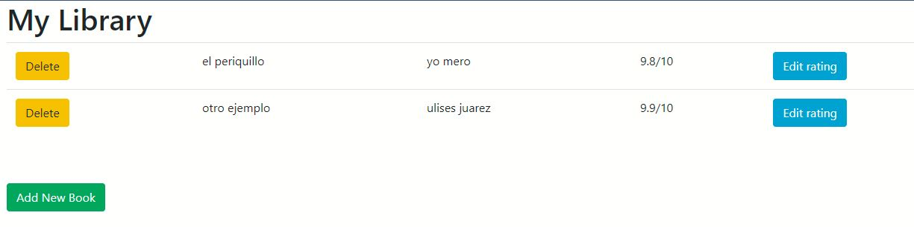
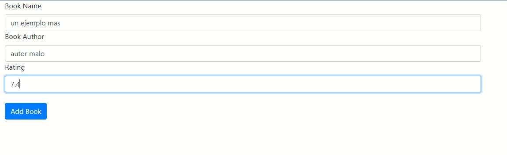
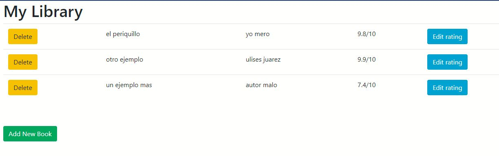
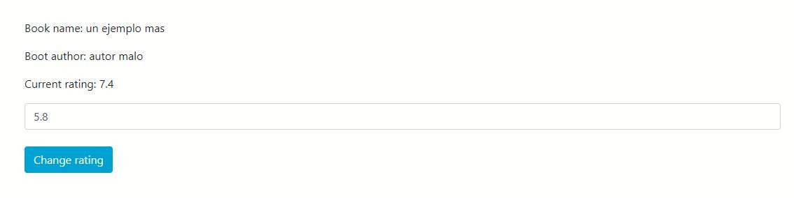
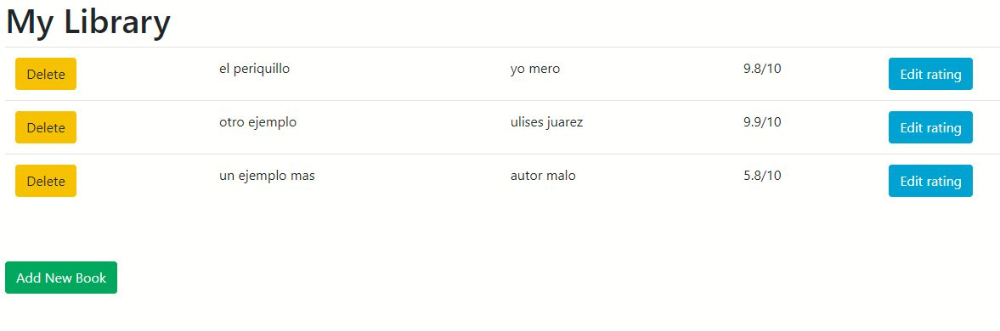
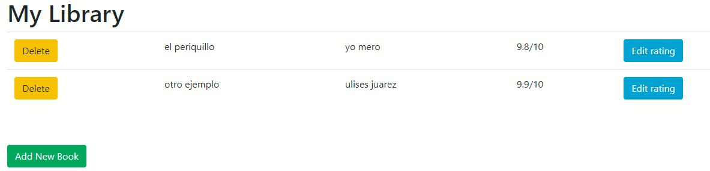

# Aplicación de libros

 Esta aplicación utiliza SQLite y SQLAlchemy para hacer un crud sencillo en python,
 permitiendome llevar un control de los libros que quiera, insertando nuevos libros, editando el rating del libro y eliminando los registros que ya no se deseen. 

---

Vemos la página de inicio 

---

Ahora agregamos un nuevo libro

---

Se nos actualizarán automaticamente esos registros

---

Podemos actualizar los rating de los libros que se deseen 

---

Observamos el nuevo rating actualizado

---

Tambien podemos eliminar los registros que ya no se quieran
